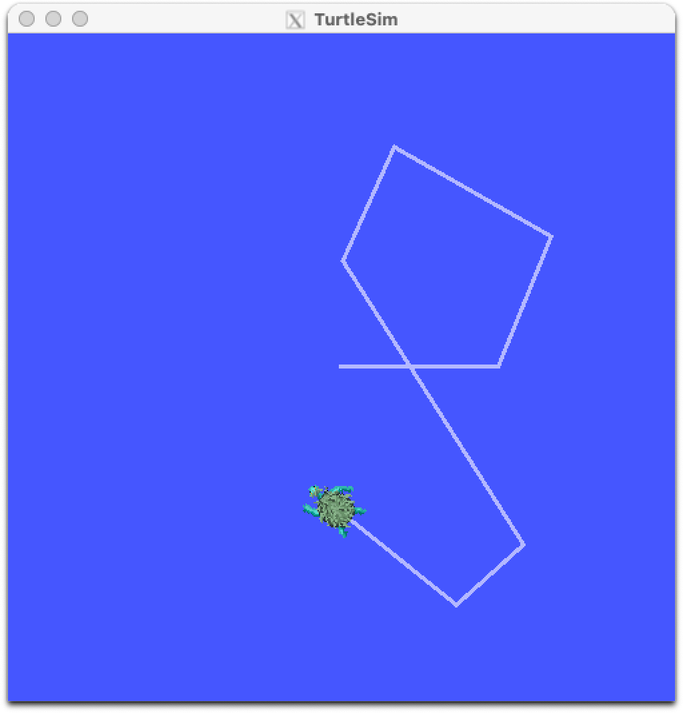

# ros-experiments

A dockerised environment for testing ROS 2 applications, with support for UI over X11.



## Prerequisites

These scripts assume you are running OS X, and assume you have [Homebrew](https://brew.sh/) installed.

Install the remaining prerequisites with:

```bash
scripts-host-init/install-prerequisites-osx.sh
```

This checks for and installs the following if they are not present:

* [Docker](https://hub.docker.com/editions/community/docker-ce-desktop-mac) - container environment
* [socat](http://manpages.ubuntu.com/manpages/bionic/man1/socat.1.html) - socket relay
* [XQuartz](https://www.xquartz.org/) - X11 windowing system support for OS X

If you haven't already, adjust the configuration of XQuartz to permit remote network connections:

1. Open up _Preferences_ from the _XQuartz_ menu and go to the last tab: _security_
1. Ensure that _allow connections from network clients_ is enabled.

## Getting started

Create the docker image:

```bash
./build-ros-base.sh
```

Launch it:

```bash
./launch-ros-base-interactive.sh
```

## Test with TurtleSim

From the ROS interactive prompt, launch TurtleSim:

```bash
/scripts/launch-turtle-sim-node.sh
```

If socat is forwarding X11 requests, and XQuartz is running and accepts the connection, you'll see the TurtleSim window with a random turtle at the centre.

Launch the TurtleSim keyboard controller:

```bash
/scripts/launch-turtle-teleop-node.sh
```

You should be able to control the turtle with the arrow keys. Press `Q` to quit.

## Visualising ROS state

Launch `rqt` to view and manage ROS nodes, topics, services, and actions:

```bash
/scripts/launch-rqt.sh
```

For a deeper understanding of these concepts, and for more tools to manage ROS, see the `notes` folder.

## Folder structure

* `scripts-docker-build` - scripts used as the docker image is built.
* `scripts-docker-runtime` - scripts available to the docker image at runtime.
* `scripts-host-init` - scripts to help setup the host operating system (eg. OS X).
* `notes` - a series of notes describing ROS concepts and tools.
